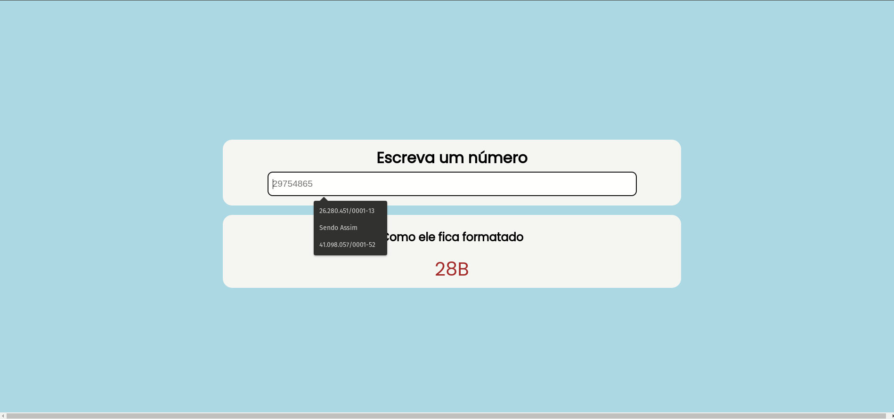

# Seja bem vindo a um dos meus #JokeCodes
Nesse código vou te ensinar como formatar os números no estilo do **Instagram e Youtube...** usando a **API Global** chamada Intl, para essa bela tarefa!



## Como usar esse repositório?
Para usar, basta baixar e/ou clonar o repositório e ter instalado o Live Server no seu VSCode para rodar o código html!

## Como isso foi feito?

### HTML
Primeiro, eu criei um HTML simples com alguns elementos, uma `main` com duas Divs, uma para a gente inserir o número não formatado e a outra para ver o resultado `output` do nosso número formatado!

```html
  <main>
    <div class="conteudo">
      <h1>Escreva um número</h1>
      <input type="text" id="input" placeholder="29754865">
    </div>
    <div class="resultado">
      <h2>Como ele fica formatado</h2>
      <p id="output">X</p>
    </div>
  </main>
```

### CSS
Agora, vou importar a fonte **Poppins** do Google e adicionar alguns estilos a nossa página, coisas simples como Flexbox, cores de fundo, tamanhos de textos e outras coisas!

```css
@import url('https://fonts.googleapis.com/css2?family=Poppins&display=swap');

:root {
  --primary-color: #f5f5f5;
  font-family: 'Poppins';
}

body {
  width: 100%;
  height: 100vh;
  display: flex;
  flex-direction: column;
  justify-content: center;
  align-items: center;
  background: #ADD8E6;
}

main {
  width: 100%;
  display: flex;
  flex-direction: column;
  justify-content: center;
  align-items: center;
}

.conteudo, .resultado {
  width: 50%;
  display: flex;
  flex-direction: column;
  justify-content: center;
  align-items: center;

  padding: 10px;
  border-radius: 20px;
  background: var(--primary-color);
}

.resultado {
  margin-top: 20px;
}

.resultado p {
  font-size: 40px;
  font-weight: 400;
  padding: 0;
  margin: 0;
  color: brown;
}

.conteudo h1 {
  margin: 0;
  padding: 5px;
  font-size: 2em;
  font-weight: 600;
  text-align: center;
}

#input {
  width: 80%;
  height: 50px;
  border: 1px solid #ccc;
  border-radius: 10px;
  padding: 0 10px;
  font-size: 1.2em;
  margin-bottom: 10px;
}
```

### Finalmente! O JAVASCRIPT!
Agora sim! Para fazer isso a primeira coisa é pegar os elementos que vamos usar, no caso serão o `input` e o `output` que é um campo de texto do tipo `<p>`.

```javascript
const input = document.querySelector('#input');
const output = document.querySelector('#output');
```

Agora, vamos importar o formatador do `Intl.NumberFormat`, passando alguns valores como parâmetro.

```javascript
const formatador = Intl.NumberFormat('en', { notation: 'compact' });
```

Finalmente, criamos nosso event listener para escutar `keypress`, e alterar o valor do nosso `output` para o valor que está no campo de `input` porém, formatado!
```javascript
input.addEventListener('keypress', () => {
  const value = input.value || 1;
  const formatado = formatador.format(value);
  output.textContent = formatado;
});
```

# E é assim que se faz!
Código javascript completo:
```javascript
const input = document.querySelector('#input');
const output = document.querySelector('#output');

// Vamos usar o Intl uma API Global para formatar os números
const formatador = Intl.NumberFormat('en', { notation: 'compact' });

input.addEventListener('keypress', () => {
  const value = input.value || 1;
  const formatado = formatador.format(value);
  output.textContent = formatado;
});
```